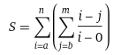
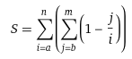
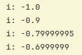
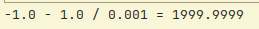

# Лабораторна робота №1

Тема:
Основні типи та оператори мови програмування Java.  
Мета:
Ознайомлення з основними типами та операторами в Java. Здобуття навичок у використанні типів та операторів в Java.

З умовою можна ознайомитися за [посиланням](https://asdjonok.github.io/OOP-SITE/)

Номер залікової книжки: 1209  
- С2 - остача від ділення номера заліковки на 2:   
= 1209 % 2 = 1 => **O1 = "-"**    

- С3 - остача від ділення номера заліковки на 3:  
= 1209 % 3 = 0 => **C = 0** 
  
- С5 - остача від ділення номера заліковки на 5:  
= 1209 % 5 = 4 => **O2 = "-"**
  
- С7 - остача від ділення номера заліковки на 7:  
= 1209 % 7 = 5 => **Тип i та j - "float"**  

=> Загальна формула:  

  
Спрощений варіант:  

---
## BigDecimal у коді
В якийсь момент у мене почали падати тести, хоча за реалізацією все наче було правильно. Подивившись логи, побачила наступне:  
  
  
Чому так відбувається можна почитати [тут](https://floating-point-gui.de/).  
Я ж вирішила цю проблему привівши тип float до типу BigDecimal.  